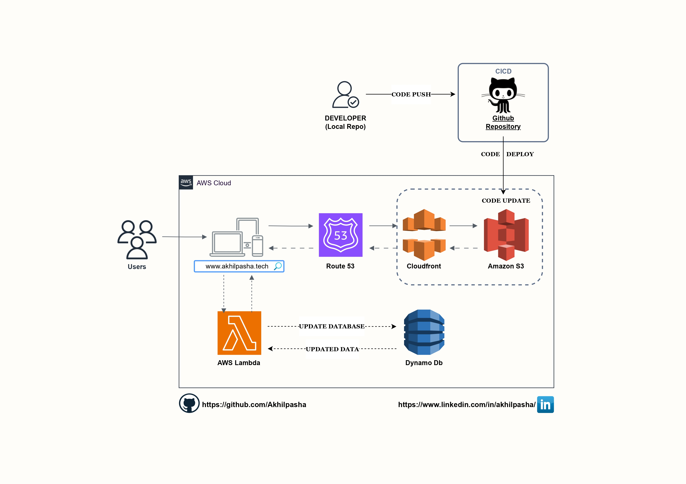

# AWS_Cloud-Resume
This is an Architecture and a Live working website of a CLOUD_RESUME_CHALLENGE built using "Amazon Web Services". 
It is a Multitier process of building your Portfolio/Resume for upskilling in Cloud-computing, AWS etc..

## Architecture :

## Services Used :

- AWS Lambda
- S3
- AWS Cloudfront
- Dynamo DB
- IAM
- GitHub Actions

## [Go Live](https://www.akhilpasha.tech/)
Click on "Go Live" to checkout the website.

## Done by
- LinkedIn:[AkhilPasha](https://www.linkedin.com/in/akhilpasha/)
- Gmail: [akhilpasha704@gmail.com]
